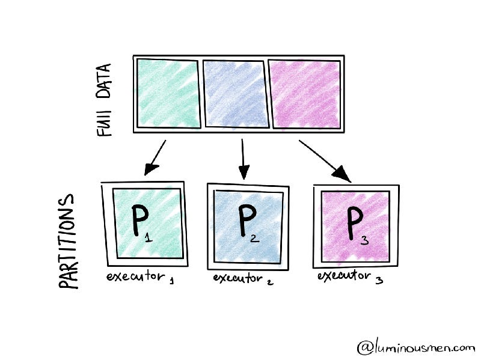

# What is RDD?
**Before we dive into the "why" of RDD immutability, let's first clarify what an RDD is.**

**RDD stands for Resilient Distributed Dataset. Contrary to what the name might suggest, it’s not a traditional collection of data like an array or list. Instead, an RDD is an abstraction Spark provides to represent a large collection of data distributed across a computer cluster. Under the hood, these RDDs are stored in partitions on different nodes across the cluster.**

**A partition is essentially a logical chunk of a large distributed dataset. It allows Spark to distribute the work across the cluster, dividing tasks into smaller parts, and reducing memory requirements on each node. Partitions are the primary unit of parallelism in Spark. Even if you aren’t directly aware of partitions, Spark leverages them behind the scenes to optimize distributed data processing. Manipulating the size and number of partitions can further speed up data processing in advanced use cases.**

**This abstraction allows users to perform various transformations and actions on distributed data without dealing with the underlying complexity of partitioning, fault tolerance, or the mechanics of distributed computing.**

**When you perform operations on an RDD, Spark doesn’t immediately compute the result. Instead, it creates a new RDD with the transformation applied, allowing for lazy evaluation.**

## Why Are RDDs Immutable?
**RDDs are immutable - they cannot be changed once created and distributed across the cluster's memory. But why is immutability such an essential feature? Here are a few reasons:**

### Functional Programming Influence
**RDDs in Apache Spark are strongly influenced by functional programming concepts, which emphasize immutability and pure functions. Immutability ensures that once an RDD is created, it cannot be changed. Instead, any operation on an RDD creates a new RDD. Using immutability, Spark leverages these functional programming principles to enhance performance and maintain consistency in its distributed environment.**

### Support for Concurrent Consumption
**RDDs are designed to support concurrent data processing. In a distributed environment where multiple nodes might access and process data concurrently, immutability becomes crucial. Immutable data structures ensure that data remains consistent across threads, eliminating the need for complex synchronization mechanisms and reducing the risk of race conditions. Each transformation creates a new RDD, eliminating the risk of race conditions and ensuring the integrity of the data.**

### In-Memory Computing 
**Apache Spark is known for its ability to perform in-memory computations, which significantly boost performance. In-memory data is fast, and immutability plays a key role in this process. Immutable data structures eliminate the need for frequent cache invalidation, making it easier to maintain consistency and reliability in a high-performance computing environment.**

### Lineage and Fault Tolerance
**The “Resilient” in RDD refers to its ability to recover from failures quickly. This resilience is crucial for distributed computing, where failures can be relatively common. RDDs provide fault tolerance through a lineage graph - a record of the series of transformations that have been applied.**

**Lineage allows Spark to reconstruct a lost or corrupted RDD by tracing back through its transformation history. Since RDDs are immutable, they provide a deterministic way to regenerate the previous state, even after failures. This lineage feature is crucial for fault tolerance and data recovery in Spark. If RDDs were mutable, it would be challenging to deterministically regenerate the previous state in case of node failures. Immutability ensures that the lineage information remains intact and allows Spark to recompute lost data reliably.**

### Further Exploration: Grokking Concurrency
**If you find the concept of immutability intriguing - especially in the context of distributed systems - concurrency is another concept worth exploring. Immutability simplifies concurrency, a core challenge in big data environments. Understanding how multiple processes can run in parallel without conflict is vital for writing efficient code.**

**By the way, if concurrency and immutability caught your interest, I dive deeper into these topics with hands-on examples in my book, Grokking Concurrency. It’s packed with practical tips to help you build scalable, efficient, and fault-tolerant applications.**

### Outro
**At the end of the day, immutability is one of the things that makes Spark so fast and reliable. Immutability ensures predictability, supports concurrent processing, enhances in-memory computing, and plays a pivotal role in Spark’s fault tolerance mechanisms. Without RDD immutability, Spark’s robustness and performance would be significantly compromised.**

**Immutability might seem like an abstract or academic concept, but in practice, it allows data pipelines to scale gracefully while minimizing risks of failure or inconsistency. Whether you're building ETL processes, machine learning pipelines, or real-time data streams, immutability is a critical concept that enhances both reliability and performance.**
