# If you're learning Apache Spark, this article is for you

## Intro
At the time of this writing, Apache Spark has been released in its fourth major version, which includes many improvements and innovations.

However, I believe its core and fundamentals won’t change soon.

I have written this article to help you establish a good baseline for learning and researching Spark. It distills everything I know about this infamous engine.

> Note: This article contains illustrations with many details. I recommend reading it on a laptop or PC to get the full experience.

--- 

In 2004, Google released a paper introducing a programming paradigm called MapReduce to distribute the data processing to hundreds or thousands of machines.

In MapReduce, users have to explicitly define the Map and the Reduce functions:

- Map: It takes key/value pair inputs, processes them, and outputs intermediate key/value pairs. Then, all values of the same key will be grouped and passed to the Reduce tasks.

- Reduce: It receives intermediate values from Map tasks. It then merges the intermediate values from the same key using the defined logic (e.g., Count, Sum, ...)

To ensure fault tolerance (e.g., a worker dies during the process), MapReduce relies on disk to exchange intermediate data between data tasks.

Based on Google's paper, Yahoo released the open-sourced implementation of MapReduce, which soon became the go-to solution for distributed data processing. It rose and dominated, but it wouldn’t last long.

The strict Map and Reduce paradigm limits the flexibility, and the disk-based data exchange might not be suitable for use cases like machine learning or interactive queries.

UC Berkeley’s AMPLab saw a problem that needed to be solved. Although cluster computing had a lot of potential, they observed that the MapReduce implementation might not be efficient.

They created Apache Spark, a functional programming-based API to simplify multistep applications, and developed a new engine for efficient in-memory data sharing across computation steps.

--- 

## Spark RDD
Unlike MapReduce, Spark relies heavily on in-memory processing. The creator introduced the Resilient Distributed Dataset (RDD) abstraction to manage Spark’s data in memory. No matter the abstraction you use, from dataset to dataframe, they are compiled into RDDs behind the scenes.

RDD represents an immutable, partitioned collection of records that can be operated on in parallel. Data inside RDD is stored in memory for as long as possible.

## Why RDD immutable
You might wonder why Spark RDDs are immutable. Here are some of my notes:

- Concurrent Processing: Immutability keeps data consistent across multiple nodes and threads, avoiding complex synchronization and race conditions.

- Lineage and Fault Tolerance: Each transformation creates a new RDD, preserving the lineage and allowing Spark to recompute lost data reliably. Mutable RDDs would make this much harder.

- Functional Programming: RDDs follow principles that emphasize immutability, making handling failures easier and maintaining data integrity.

## Properties
Each RDD in Spark has five key properties:

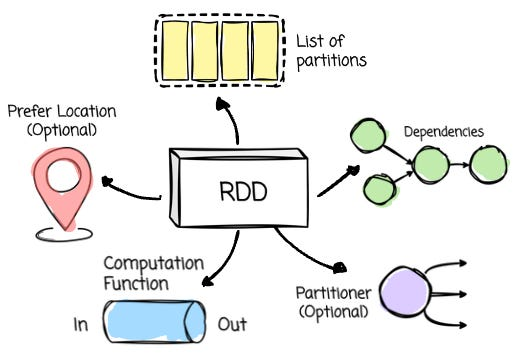

- List of Partitions: An RDD is divided into partitions, Spark's parallelism units. Each partition is a logical data subset and can be processed independently with different executors (more on executors later).

- Computation Function: A function determines how to compute the data for each partition.

- Dependencies: The RDD tracks its dependencies on other RDDs, which describe how it was created.

- Partitioner (Optional): For key-value RDDs, a partitioner specifies how the data is partitioned, such as using a hash partitioner.

- Preferred Locations (Optional): This property lists the preferred locations for computing each partition, such as the data block locations in the HDFS.

## Lazy
When you define the RDD, its data is unavailable or transformed immediately until an action triggers the execution. This approach allows Spark to determine the most efficient way to execute the transformations. Speaking of transformation and action:

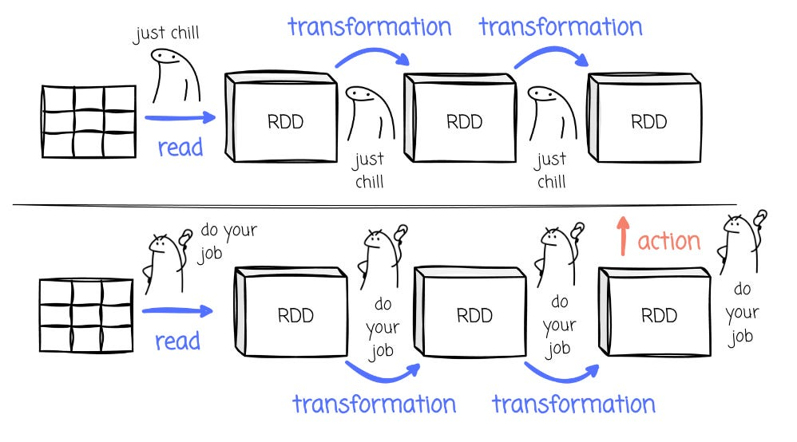

- Transformations, such as map or filter, define how the data should be transformed, but they don't execute until an action forces the computation. Because RDD is immutable, Spark creates a new RDD after applying the transformation.

- Actions are the commands that Spark runs to produce output or store data, thereby driving the actual execution of the transformations.

## Fault Tolerance
Spark RDDs achieve fault tolerance through lineage.

As mentioned, Spark keeps track of each RDD’s dependencies on other RDDs, the series of transformations that created it.

Suppose any partition of an RDD is lost due to a node failure or other issues. Spark can reconstruct the lost data by reapplying the transformations to the original dataset described by the lineage.

This approach eliminates the need to replicate data across nodes or write data to disk (like MapReduce).

---

Architecture
A Spark application consists of:

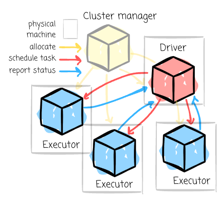

- Driver: This JVM process manages the entire Spark application, from handling user input to distributing tasks to the executors.

- Cluster Manager: This component manages the cluster of machines running the Spark application. Spark can work with various cluster managers, including YARN, Apache Mesos, or its standalone manager.

- Executors: These processes execute tasks the driver assigns and report their status and results. Each Spark application has its own set of executors.

The Spark Driver-Executors cluster differs from the cluster hosting your Spark application. To run a Spark application, there must be a cluster of machines or processes (if you’re running Spark locally) that provides resources to Spark applications.

The cluster manager manages this cluster and the machines that can host driver and executor processes, called workers.

---

## Mode
Spark has different modes of execution, which are distinguished mainly by where the driver process is located.

- Cluster Mode: The driver process is launched on a worker node alongside the executor processes in this mode. The cluster manager handles all the processes related to the Spark application.

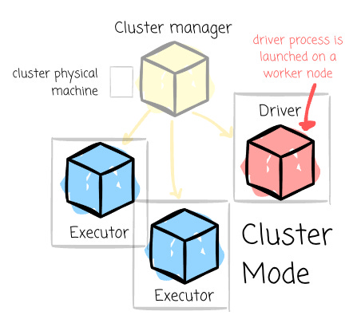

- Client Mode: The driver remains on the client machine that submitted the application. This setup requires the client machine to maintain the driver process throughout the application’s execution.

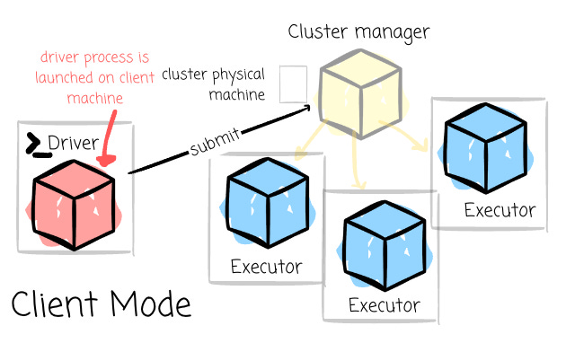

- Local mode: This mode runs the entire Spark application on a single machine, achieving parallelism through multiple threads. It’s commonly used for learning Spark or testing applications in a simpler, local environment.

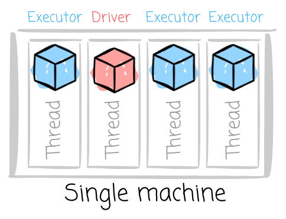

--- 

## Anatomy
It’s crucial to understand how Spark manages the workload:

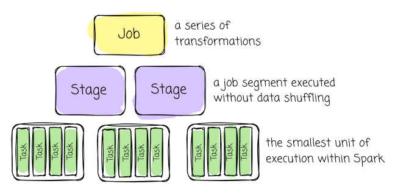

- Job: A job represents a series of transformations applied to data. It encompasses the entire workflow from start to finish.

- Stage: A stage is a job segment executed without data shuffling. A job is split into different stages when a transformation requires shuffling data across partitions.

- DAG: In Spark, RDD dependencies are used to build a Directed Acyclic Graph (DAG) of stages for a Spark job. The DAG ensures that stages are scheduled in topological order.

- Task: A task is the smallest unit of execution within Spark. Each stage is divided into multiple tasks, which execute processing in parallel across different partitions.

You might wonder about the “data shuffling” from the Stage’s part. To dive into shuffle, it’s helpful if we could understand the narrow and wide dependencies:

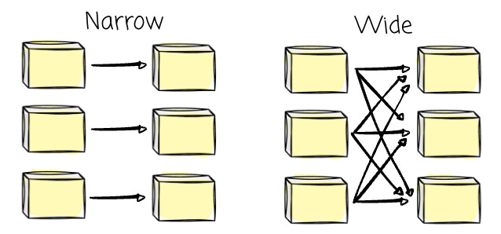

- Transformations with narrow dependencies are those where each partition in the child RDD has a limited number of dependencies on partitions in the parent RDD. These partitions may depend on a single parent (e.g., the map operator) or a specific subset of parent partitions known beforehand (such as with coalesce).

- Transformations with wide dependencies require data to be partitioned in a specific way, where a single partition of a parent RDD contributes to multiple partitions of the child RDD. This typically occurs with operations like groupByKey, reduceByKey, or join, which involve shuffling data. Consequently, wide dependencies result in stage boundaries in Spark's execution plan.

---

## A typical journey of the Spark application

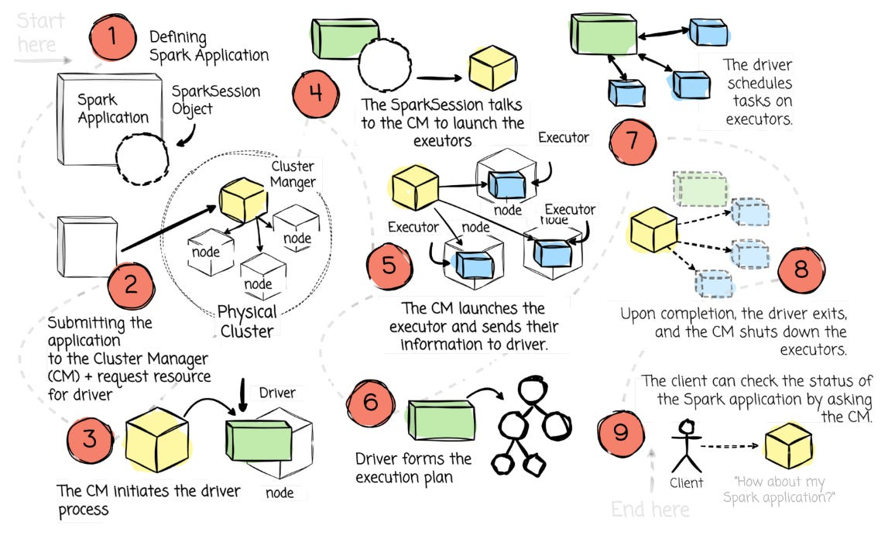

- The user defines the Spark Application. It must include the SparkSession object, serving as the central gateway for interacting with all Spark's functionalities.

- The client submits a Spark application to the cluster manager. At this step, the client also requests the driver resource.

- When the cluster manager accepts this submission, it places the driver process in one of the worker nodes.

- The driver asks the cluster manager to launch the executors. The user can define the number of executors and related configurations.

- If things go well, the cluster manager launches the executor processes and sends the information about their locations to the driver process.

- The driver formulates an execution plan to guide the physical execution. This process starts with the logical plan, which outlines the intended transformations.

- It generates the physical plan through several refinement steps, specifying the detailed execution strategy for processing the data.

> We’ll explore the Spark planning process in the following section.

- The driver starts scheduling tasks on executors, and each executor responds to the driver with the status of those tasks.

- Once the application finishes, the driver exits with either success or failure. The cluster manager then shuts down the application’s executors.

- The client can check the status of the Spark application by asking the cluster manager.

---  

## Plan
> How does the driver know to execute the job?

Spark has an optimizer called the Catalyst Optimizer.

Spark's creator designed Catalyst based on functional programming constructs in Scala. Catalyst supports both rule-based and cost-based optimization.

> Rule-Based Optimization (RBO): Rule-based optimization in databases relies on predefined rules and heuristics to choose the execution plan for a query.

> Cost-Based Optimization (CBO): Cost-based optimization, on the other hand, uses statistical information about the data—such as table size, index selectivity, and data distribution—to estimate the cost of various execution plans. The optimizer evaluates multiple potential plans and chooses the lowest estimated cost.

Before the actual data process on executors, the logic must go through an optimized process that contains four phases: analyzing the logical plan, optimizing the logical plan, physical planning, and code generation.

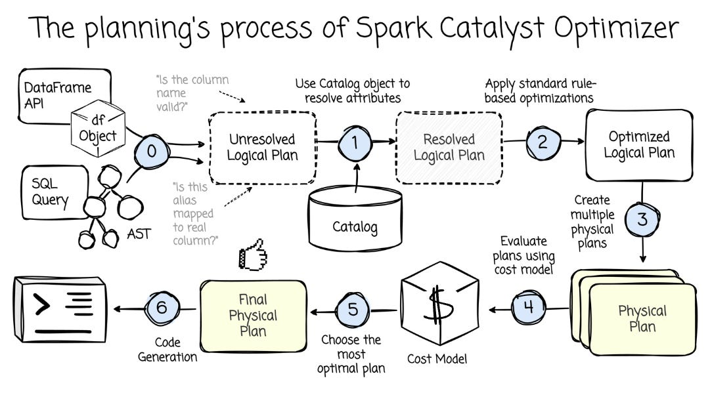

- Analysis: The optimizer uses the rules and the catalog to answer questions like “Is the column/table name valid?” or “What is the column’s type?”.

> The Catalog object enables interaction with metadata for databases, tables, and functions. It allows users to list, retrieve, and manage these entities and refresh table metadata to keep Spark's view in sync with underlying data sources.

- Logical Optimization: Spark applies standard rule-based optimizations, such as predicate pushdown, projection pruning, null propagation, etc.

- Physical Planning: Based on the logical plan, the optimizer generates one or more physical plans and selects the final one using a cost model.

- Code Generation: The final query optimization phase generates Java bytecode for execution.

The Catalyst optimizer uses the cost model framework to choose the optimal plan at the end of physical planning. The framework leverages different data statistics (e.g., row count, cardinality, max/min values, etc.) to choose the optimal plan.

However, what happens when the statistics are outdated or unavailable?.

Apache Spark 3, released in 2020, introduced Adaptive Query Execution (AQE) to tackle such problems. AQE allows query plans to be adjusted based on runtime statistics collected during execution.

When finishing processing each stage, the executors materialize the stage’s intermediate results. The next stage can only begin once the previous stage is complete. This pause creates an opportunity for re-optimization, as data statistics from all partitions are available before the following operations start.

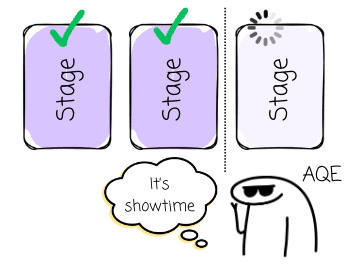

This allows Sparks to employ optimization techniques such as combining smaller partitions into bigger ones to improve efficiency, splitting huge partitions into smaller ones to reduce stress on a single worker, or switching join strategies at run time (e.g., switching to broadcast join)

---

Scheduling Process
So we have the plan, what’s next?

Before physical execution on the executors, there is a scheduling process to assign tasks to the executors.

This process involves some components:

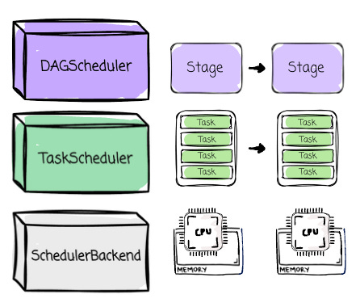

- The DAGScheduler for stage-oriented scheduling

- The TaskScheduler for task-oriented scheduling

- The SchedulerBackend interacts with the cluster manager and provides resources to the TaskScheduler.

These components are created during the initialization of the driver process.

The DAGScheduler is responsible for scheduling the stages according to the DAG's topological order. Each stage is submitted once all its upstream dependencies are completed.

The DAGScheduler creates a TaskSet for each stage, which includes fully independent and unprocessed tasks of a stage. Then, the DAGScheduler sends the TaskSet to the TaskScheduler. The DAGScheduler also determines the preferred locations for each task based on the current cache status and sends these to the TaskScheduler.

The TaskScheduler is responsible for scheduling tasks from the TaskSet on available executors. It requests resources from the SchedulerBackend to schedule tasks.

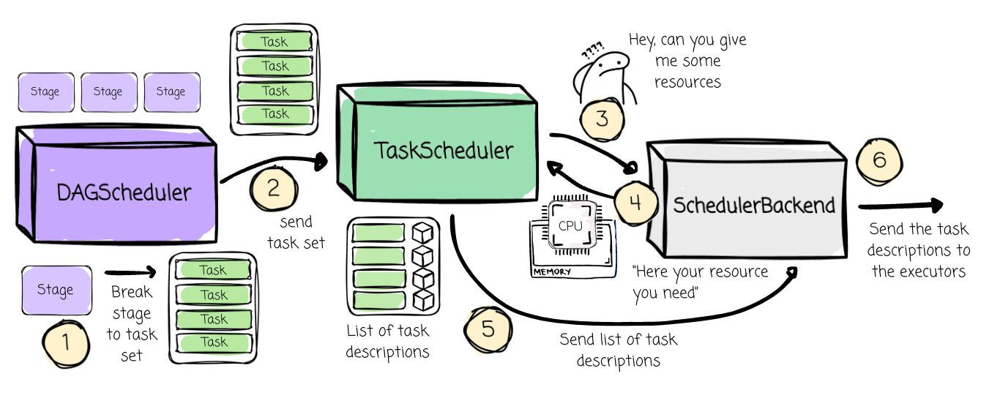

The SchedulerBackend requests executors from the cluster manager, which then launches executors based on the application's requirements. Once started, the executors attempt to register with the SchedulerBackend through an RPC endpoint. If successful, the SchedulerBackend receives a list of the application's desired executors.

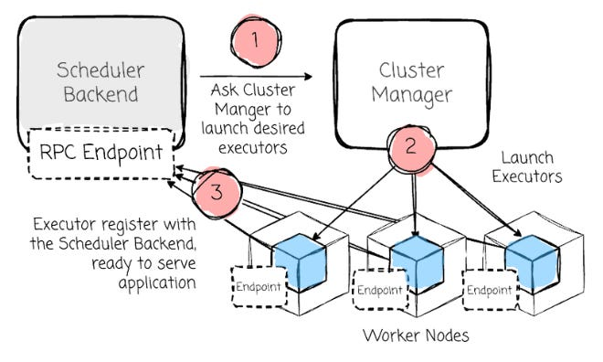

When the TaskScheduler requests resources, the SchedulerBackend informs the TaskScheduler about the available resources on the executors.

The TaskScheduler assigns tasks to these resources, resulting in a list of task descriptions. For each entry in this list, the SchedulerBackend serializes the task description and sends it to the executor.

The executor deserializes the task description and begins launching the task.

---

## Scheduling Mode
The above section shows how a job will be scheduled at the task level. What if the cluster has two or three jobs to run, which one will run first?

There are two job schedule modes in Spark:

- First In First Out (FIFO): By default, jobs are run in FIFO order. The first job gets all available resources, followed by the next jobs. Later jobs can start running immediately if the first job doesn’t consume the cluster’s resources. However, later jobs may remain pending if prior jobs use up all the resources.

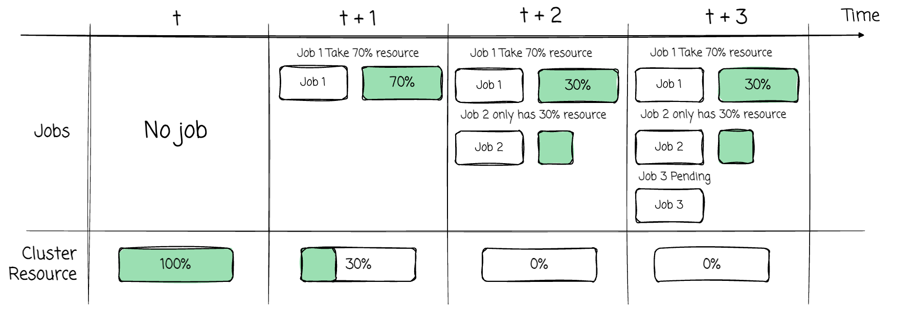

Fair: Since Spark 0.8, the user can configure fair scheduling between jobs. With this mode, Spark assigns tasks between jobs in a round-robin fashion to ensure equal resource sharing. This implies that short jobs submitted while a long job is running can start receiving resources immediately without waiting for the long job to finish.

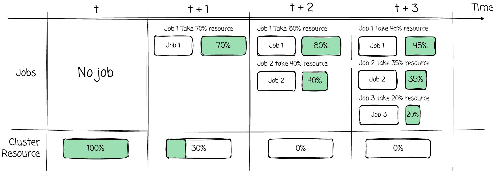

  - The fair scheduler supports grouping jobs into pools and setting various scheduling options for each pool, such as the weight. This can help isolate workload so critical jobs can be executed on a larger resource pool. The user can configure which jobs can be run on which pools.

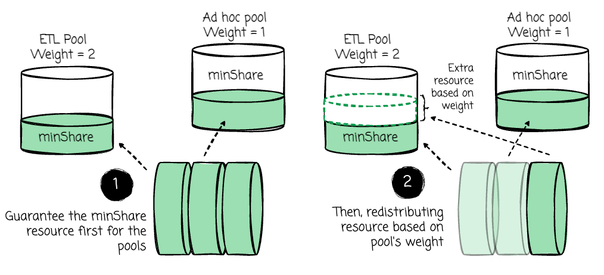