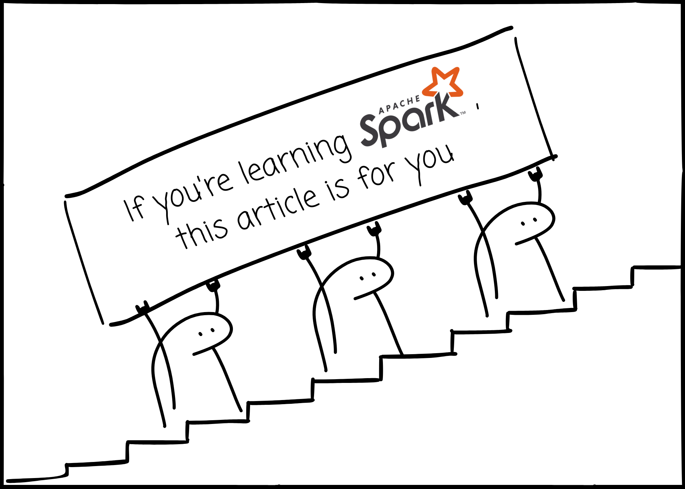
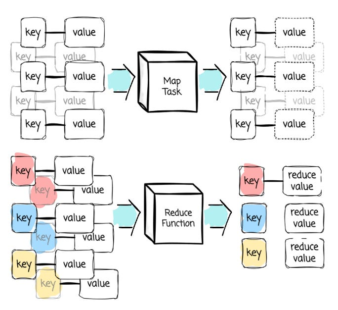
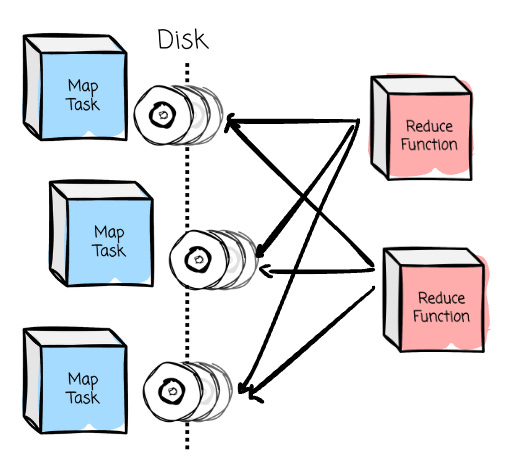

# If you're learning Apache Spark, this article is for you

## Intro
At the time of this writing, Apache Spark has been released in its fourth major version, which includes many improvements and innovations.

However, I believe its core and fundamentals won’t change soon.

I have written this article to help you establish a good baseline for learning and researching Spark. It distills everything I know about this infamous engine.

> Note: This article contains illustrations with many details. I recommend reading it on a laptop or PC to get the full experience.

--- 

In 2004, Google released a paper introducing a programming paradigm called MapReduce to distribute the data processing to hundreds or thousands of machines.

In MapReduce, users have to explicitly define the Map and the Reduce functions:

- Map: It takes key/value pair inputs, processes them, and outputs intermediate key/value pairs. Then, all values of the same key will be grouped and passed to the Reduce tasks.

- Reduce: It receives intermediate values from Map tasks. It then merges the intermediate values from the same key using the defined logic (e.g., Count, Sum, ...)

To ensure fault tolerance (e.g., a worker dies during the process), MapReduce relies on disk to exchange intermediate data between data tasks.

Based on Google's paper, Yahoo released the open-sourced implementation of MapReduce, which soon became the go-to solution for distributed data processing. It rose and dominated, but it wouldn’t last long.

The strict Map and Reduce paradigm limits the flexibility, and the disk-based data exchange might not be suitable for use cases like machine learning or interactive queries.

UC Berkeley’s AMPLab saw a problem that needed to be solved. Although cluster computing had a lot of potential, they observed that the MapReduce implementation might not be efficient.

They created Apache Spark, a functional programming-based API to simplify multistep applications, and developed a new engine for efficient in-memory data sharing across computation steps.
