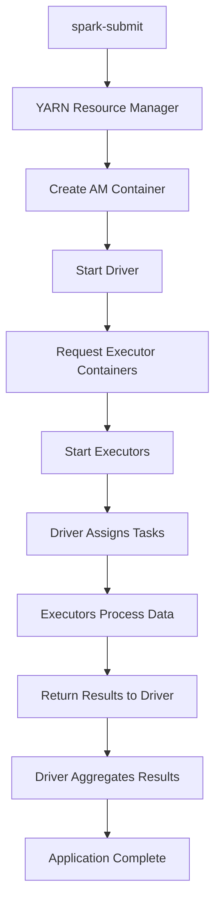

# Apache Spark Runtime Architecture

## 📚 Introduction

Apache Spark is a distributed computing platform where **every Spark application is a distributed application in itself**. This comprehensive guide explains the complete runtime architecture of Apache Spark applications.

> 🔑 **Key Concept**: Every Spark application is a distributed application that runs across multiple machines in a cluster!

---

## 🖥️ Understanding Clusters

### What is a Cluster?

A cluster is a pool of networked physical computers working together as a single system.

```
┌─────────────────────────────────────────────────────────────┐
│                    CLUSTER OVERVIEW                         │
├─────────────────────────────────────────────────────────────┤
│                                                             │
│   Worker 1      Worker 2      Worker 3    ...   Worker 10  │
│   16 cores      16 cores      16 cores          16 cores   │
│   64 GB RAM     64 GB RAM     64 GB RAM         64 GB RAM  │
│                                                             │
│   Total Capacity: 160 CPU cores + 640 GB RAM               │
└─────────────────────────────────────────────────────────────┘
```

### Cluster Components

- **Worker Nodes**: Individual machines in the cluster
- **Resources**: CPU cores and memory available on each node
- **Cluster Manager**: YARN Resource Manager or Kubernetes Master

### Supported Cluster Technologies

| Technology | Market Share | Usage |
|------------|--------------|-------|
| **Hadoop YARN** | ~50% | Most common, mature ecosystem |
| **Kubernetes** | ~40% | Cloud-native, growing rapidly |
| Apache Mesos | <5% | Declining usage |
| Spark Standalone | <5% | Development/testing |

> 💡 **Note**: YARN and Kubernetes cover more than 90% of production deployments

---

## 🚀 How Spark Applications Run

### Application Submission Process

```mermaid
graph LR
    A[spark-submit] --> B[YARN Resource Manager]
    B --> C[Creates AM Container]
    C --> D[Starts main() method]
```

### Step-by-Step Execution

1. **Submit Application**
   ```bash
   spark-submit --master yarn myapp.py
   ```

2. **Container Creation**
   - YARN creates Application Master (AM) container
   - Allocates resources (e.g., 4 cores, 16 GB RAM)
   - Starts on an available worker node

3. **Application Startup**
   - Main() method begins execution
   - Driver initializes within container

---

## 📦 Understanding Containers

### What is a Container?

A **container** is an isolated virtual runtime environment with allocated CPU and memory resources.

```
Worker Node (Total: 16 cores, 64 GB RAM)
│
├── AM Container
│   ├── Allocated: 4 cores, 16 GB RAM
│   ├── Running: Application Driver
│   └── Isolated from other processes
│
└── Available: 12 cores, 48 GB RAM
```

### Container Properties

- ✅ Isolated runtime environment
- ✅ Fixed resource allocation
- ✅ Cannot exceed allocated resources
- ✅ Managed by cluster manager

---

## 🎯 Driver Architecture

### PySpark Application Architecture

```
┌─────────────────────────────────────────┐
│          AM Container                   │
├─────────────────────────────────────────┤
│                                         │
│   ┌─────────────────────┐              │
│   │   PySpark Driver    │              │
│   │   (Python Process)  │              │
│   └──────────┬──────────┘              │
│              │                          │
│          Py4J Bridge                    │
│              │                          │
│              ▼                          │
│   ┌─────────────────────┐              │
│   │  Application Driver │              │
│   │   (JVM Process)     │              │
│   └─────────────────────┘              │
│                                         │
└─────────────────────────────────────────┘
```

#### How PySpark Works

1. **PySpark Layer**: Python wrapper over Scala/Java code
2. **Py4J Connection**: Enables Python → Java communication
3. **JVM Layer**: Actual Spark execution happens here

> 🔍 **Deep Dive**: PySpark is not a reimplementation of Spark in Python. It's a Python API that communicates with the JVM-based Spark engine.

### Scala/Java Application Architecture

```
┌─────────────────────────────────────────┐
│          AM Container                   │
├─────────────────────────────────────────┤
│                                         │
│   ┌─────────────────────┐              │
│   │  Application Driver │              │
│   │   (JVM Process)     │              │
│   │                     │              │
│   │   Direct Spark      │              │
│   │   Execution         │              │
│   └─────────────────────┘              │
│                                         │
└─────────────────────────────────────────┘
```

#### Advantages of Scala/Java

- ✅ No translation overhead
- ✅ Direct JVM execution
- ✅ Better performance
- ✅ Full Spark API access

---

## ⚡ Distributed Processing with Executors

### How Executors are Created

```
Driver Process
    │
    ├── 1. Request containers from YARN
    │
    ├── 2. YARN allocates containers
    │
    └── 3. Start executors in containers
        │
        ├── Executor 1 (4 cores, 16 GB)
        ├── Executor 2 (4 cores, 16 GB)
        ├── Executor 3 (4 cores, 16 GB)
        └── Executor 4 (4 cores, 16 GB)
```

### Distributed Application Architecture

```
┌───────────────────────────────────────────────────────────┐
│                   SPARK APPLICATION                       │
├───────────────────────────────────────────────────────────┤
│                                                           │
│   ┌─────────────┐         Task Assignment                │
│   │   DRIVER    │ ◄──────────────────────────┐           │
│   │  (Control)  │                            │           │
│   └──────┬──────┘                            │           │
│          │                                    │           │
│          ├──────────────┬─────────────┬──────┴────────┐  │
│          ▼              ▼             ▼               ▼  │
│   ┌────────────┐ ┌────────────┐ ┌────────────┐ ┌────────────┐
│   │ EXECUTOR 1 │ │ EXECUTOR 2 │ │ EXECUTOR 3 │ │ EXECUTOR 4 │
│   │            │ │            │ │            │ │            │
│   │ Process    │ │ Process    │ │ Process    │ │ Process    │
│   │ Data       │ │ Data       │ │ Data       │ │ Data       │
│   └────────────┘ └────────────┘ └────────────┘ └────────────┘
│                                                           │
└───────────────────────────────────────────────────────────┘
```

### Roles and Responsibilities

#### Driver Responsibilities
- 📋 Creates execution plan
- 📊 Schedules tasks on executors
- 🔍 Monitors executor health
- 📈 Tracks job progress
- ❌ Does NOT process data

#### Executor Responsibilities
- 💪 Performs actual data processing
- 💾 Stores intermediate data
- 🔄 Executes assigned tasks
- 📡 Reports status to driver
- 🚀 Runs in parallel with other executors

---

## 🔧 Runtime Architecture Variations

### 1. Spark DataFrame API (Scala/Java)

**Most Efficient Architecture**

```
Application Structure:
├── Driver (JVM)
└── Executors (JVM only)
    ├── Executor 1
    ├── Executor 2
    └── Executor N

✅ No translation overhead
✅ Native JVM execution
✅ Best performance
```

### 2. PySpark DataFrame API

**Standard PySpark Architecture**

```
Application Structure:
├── PySpark Driver (Python)
│   └── connects via Py4J to →
├── Application Driver (JVM)
└── Executors (JVM only)
    ├── Executor 1
    ├── Executor 2
    └── Executor N

⚡ DataFrame operations translated to JVM
⚡ No Python workers needed
⚡ Good performance
```

### 3. PySpark with Python UDFs or Custom Libraries

**Extended Architecture with Python Workers**

```
Application Structure:
├── PySpark Driver (Python)
│   └── connects via Py4J to →
├── Application Driver (JVM)
└── Executors (JVM + Python Workers)
    ├── Executor 1
    │   ├── JVM Process
    │   └── Python Worker
    ├── Executor 2
    │   ├── JVM Process
    │   └── Python Worker
    └── Executor N
        ├── JVM Process
        └── Python Worker

⚠️ Additional overhead for Python execution
⚠️ Data serialization between JVM ↔ Python
⚠️ Required for custom Python code
```

---

## 🐍 Python Workers Explained

### When are Python Workers Needed?

| Scenario | Python Worker Required? | Reason |
|----------|------------------------|---------|
| PySpark DataFrame API | ❌ No | Translated to JVM operations |
| Python UDFs | ✅ Yes | Custom Python code execution |
| NumPy/Pandas operations | ✅ Yes | Python-specific libraries |
| Custom ML libraries | ✅ Yes | Non-Spark Python code |
| Basic SQL operations | ❌ No | Executed in JVM |

### Performance Impact

```
Data Flow with Python Workers:

JVM Executor → Serialize Data → Python Worker
                                      ↓
                                Process in Python
                                      ↓
JVM Executor ← Deserialize ← Return Results

⚠️ Serialization overhead can be significant!
```

---

## 📖 Key Terminology Reference

| Term | Description | Example |
|------|-------------|---------|
| **Cluster** | Pool of networked computers | 10-node Hadoop cluster |
| **Worker Node** | Individual machine in cluster | 16 cores, 64 GB RAM |
| **Container** | Isolated runtime environment | 4 cores, 16 GB allocation |
| **AM Container** | Application Master container | Runs the driver |
| **Driver** | Control program of Spark app | Schedules and monitors |
| **Executor** | Worker process for data | Processes partitions |
| **PySpark Driver** | Python entry point | Your .py file |
| **Application Driver** | JVM driver process | Always present |
| **Python Worker** | Python runtime in executor | For UDFs |
| **Py4J** | Python-to-Java bridge | Communication layer |

---

## 🎯 Important Points to Remember

### Core Concepts

1. **Distributed by Design**
   - Every Spark application splits work across multiple executors
   - Parallelism is automatic and fundamental

2. **Driver vs Executors**
   - Driver = Brain (manages)
   - Executors = Muscles (process)

3. **PySpark Architecture**
   - Always requires JVM underneath
   - It's a wrapper, not a reimplementation

4. **Resource Isolation**
   - Containers enforce strict limits
   - Apps cannot exceed allocated resources

5. **Python Workers**
   - Only spawned when needed
   - Add serialization overhead

---

## 💡 Best Practices

### Resource Configuration

```yaml
Recommended Executor Configuration:
- Cores per executor: 4-8
- Memory per executor: 8-16 GB
- Leave 1 core & 1-2 GB for OS
- Don't create too many small executors
```

### Performance Optimization

1. **Minimize Python UDFs**
   - Use built-in Spark functions when possible
   - Vectorized UDFs (Pandas UDFs) are more efficient

2. **Resource Planning**
   ```
   Example for 16-core, 64 GB node:
   - OS/Services: 1 core, 4 GB
   - Available: 15 cores, 60 GB
   - Config: 3 executors × 5 cores × 20 GB
   ```

3. **Monitoring**
   - Track driver memory usage
   - Monitor executor failures
   - Check for data skew

4. **Development Workflow**
   - Test locally with `local[*]`
   - Validate on small cluster
   - Scale to production cluster

---

## 🔄 Complete Execution Flow



---

## 📚 Summary

Apache Spark's runtime architecture is designed for distributed processing at scale. Understanding these components helps you:

- ✅ Design efficient applications
- ✅ Troubleshoot performance issues
- ✅ Configure resources optimally
- ✅ Choose the right APIs for your use case

Remember: **Every Spark application is a distributed application**, and this architecture enables processing massive datasets that wouldn't fit on a single machine.

---

*Last Updated: [Current Date]*
*Version: 1.0*