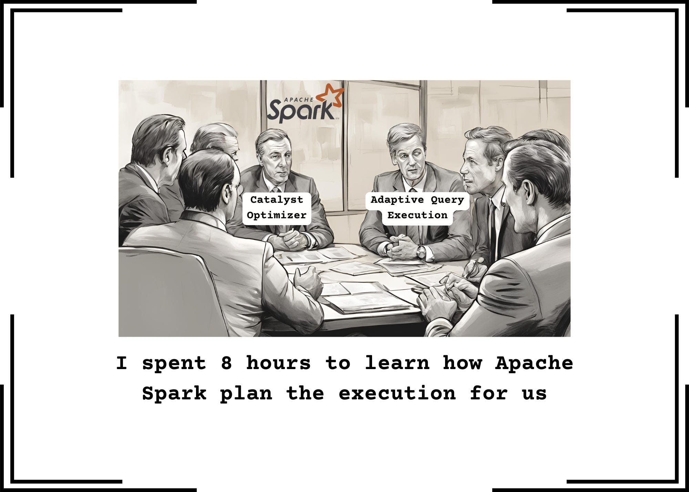
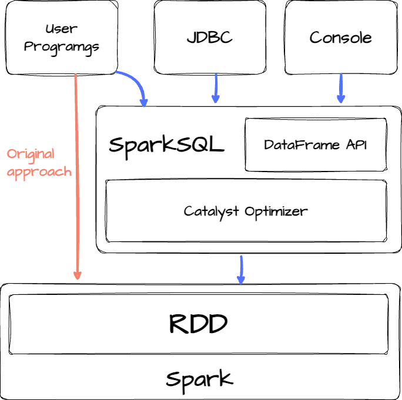
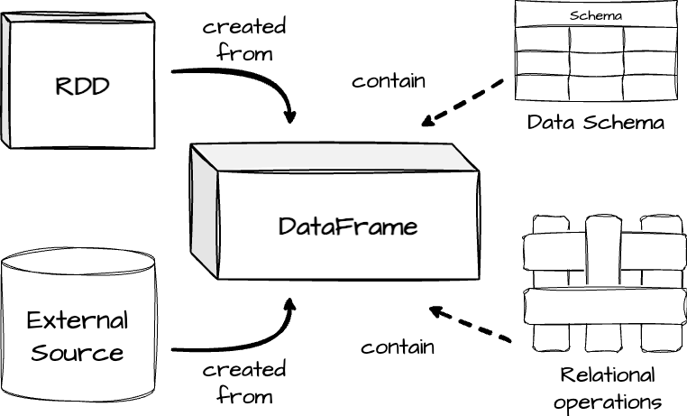
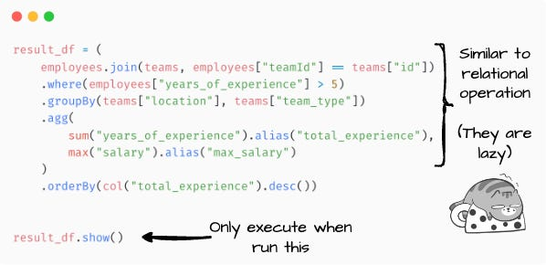
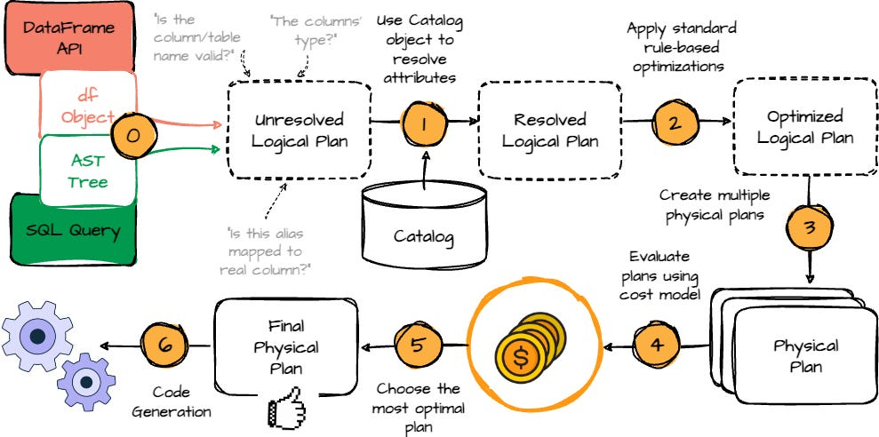
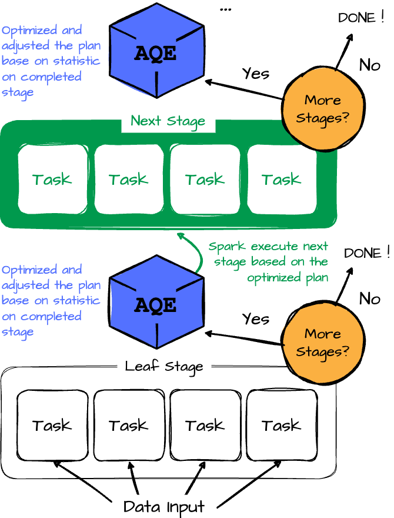

# I spent 6 hours learning how Apache Spark plans the execution for us

**Catalyst, Adaptive Query Execution, and how Airbnb leverages Spark 3.**

## Intro
**In this article, we'll explore how Apache Spark plans and optimizes its internal execution processes. The article is structured as follows: first, we'll dive into SparkSQL; next, we'll examine the Adaptive Query Execution framework introduced in Spark 3; and finally, we'll review a real case study from Airbnb, demonstrating how they leverage this framework to enhance their data warehouse.**

## Spark SQL
**In a 2015 paper, Apache Spark presented the new model Spark SQL (it was officially released in May 2014). This new module lets Spark programmers leverage the benefits of relational processing (e.g., declarative queries and optimized storage). Spark SQL introduces two significant enhancements. First, it provides a seamless integration between relational and procedural processing through a declarative DataFrame API that works smoothly with procedural Spark code. Second, it incorporates a highly extensible optimizer, Catalyst, which leverages Scala's features to facilitate the addition of composable rules and manage code generation.**

**Originally, Spark was designed as a general-purpose cluster computing engine offering a functional programming API. Users can manipulate distributed collections called Resilient Distributed Datasets (RDDs). Each RDD is a collection of Java or Python objects partitioned across a cluster.**

**The goals of SparkSQL are:**
- **Support relational processing of Spark’s native RDDs and external data sources using a convenient API.**
- **Offering high performance using DBMS techniques.**
- **Efficiently supporting new data sources,**
- **Enabling extension with advanced analytics algorithms such as graph processing and machine learning.**

**Spark SQL runs as a library on top of Spark and exposes SQL interfaces, which can be accessed via JDBC/ODBC or the DataFrame API.**

**The primary abstraction in Spark SQL’s API is a DataFrame, a distributed collection of rows with the same schema. A DataFrame is equivalent to a table in a relational database and can be manipulated similarly to RDDs. It keeps track of their schema and supports various relational operations that lead to more optimized execution.**

**DataFrames can be created from tables from external data sources or existing RDDs of native Java/Python objects. Once constructed, they can be manipulated with relational operators, such as where and groupBy. On the surface, DataFrames provide the same operations as relational query languages like SQL. However, it lets users express the processing logic using programming languages like Java, Spark, or Python.**

**Another important note: unlike the traditional dataframe APIs (e.g., Pandas Dataframe), Spark Dataframe is lazy. Each DataFrame object represents a logical plan to compute a dataset, but no execution occurs until the user calls a special output operation. (This is similar to the transformation and action in RDD.)**

**Next, we will examine Spark SQL’s Catalyst Optimizer in more detail. Spark's creator designed Catalyst based on functional programming constructs in Scala. Catalyst supports both rule-based and cost-based optimization.**

> **Rule-Based Optimization (RBO): Rule-based optimization in databases relies on a set of predefined rules and heuristics to choose the execution plan for a query. These rules are usually based on the structure of the query, the operations involved, and the database schema. The optimizer applies these rules in a fixed order, without considering the actual data distribution or workload.** 

> **Cost-Based Optimization (CBO): Cost-based optimization, on the other hand, uses statistical information about the data—such as table size, index selectivity, and data distribution—to estimate the cost of various execution plans. The optimizer evaluates multiple potential plans and chooses the one with the lowest estimated cost. However, it requires accurate statistics available.**

**Essentially, Catalyst includes a general library for representing trees and applying rules to manipulate them. Developers can extend Catalyst to support desired external data sources and user-defined types.**

**When we define the DataFrame transformation logic, before the actual execution, it must go through an optimized process that contains four phases: analyzing a logical plan, optimizing the logical plan, physical planning, and finally, code generation.**

**We will visit each phase below:**
- **Analysis: The first phase begins with a relation to be processed. It can come from the abstract syntax tree retrieved from the SQL parser or the DataFrame object defined using the DataFrame API. Both cases have unresolved attribute references or relations; is the column/table name valid? What is the columns’ type? Spark SQL uses Catalyst rules and a Catalog object to resolve these attributes. It starts by building an “unresolved logical plan” tree with unbound attributes and data types, then applies predefined rules to resolve attributes.**

> **The Spark SQL Catalog object enables interaction with metadata for databases, tables, and functions. It allows users to list, retrieve, and manage these entities, as well as refresh table metadata to keep Spark's view in sync with underlying data sources. It’s a central interface for managing and querying Spark SQL metadata.**

- **Logical Optimization: After resolving the logical plan, Spark applies standard rule-based optimizations, such as predicate pushdown, projection pruning, null propagation, and more.**

- **Physical Planning: Spark SQL takes a logical plan and generates one or more physical plans. It will select the final plan using a cost model.**

- **Code Generation: The final query optimization phase involves generating Java bytecode for execution. Spark SQL uses code generation to speed up processing, especially for CPU-bound in-memory datasets. Catalyst simplifies this by leveraging Scala’s quasiquotes, which allow programmatic construction of abstract syntax trees (ASTs) compiled into bytecode at runtime. Catalyst transforms SQL expressions into Scala ASTs, which are compiled and executed.**

**After understanding the SparkSQL original optimizer, we will move to the next section, which describes Spark's new optimization framework.**

## Spark 3 - Adaptive Query Execution
**As mentioned in the above section, the Catalyst optimizer uses the cost model framework to choose the optimal plan at the end of physical planning. The framework collects and uses different data statistics (e.g., row count, number of distinct values, NULL values, max/min values, etc.) to help Spark choose the optimal plan.**

**However, what happens when the statistics are outdated or unavailable? This can lead to suboptimal query plans. In Apache Spark 3, released in 2020, Adaptive Query Execution (AQE) was introduced to tackle such problems with the ability to adjust query plans based on runtime statistics collected during the execution.**

**Spark operators are typically pipelined and executed in parallel processes. A shuffle or broadcast exchange breaks the pipeline into query stages, where each stage materializes intermediate results. The next stage can only begin once the previous stage is complete. This pause creates an opportunity for re-optimization, as data statistics from all partitions are available before the following operations start.**

**Let's overview the flow of the AQE framework:**

- **The Adaptive Query Execution (AQE) framework starts by executing leaf stages, which do not depend on other stages. (reading data input)**

- **Once one or more of these stages complete materialization, the framework marks them as complete in the physical query plan. It updates the logical query plan with runtime statistics from the completed stages.**

- **The framework uses these new statistics to run the optimizer, applying a selected list of logical optimization rules, the physical planner, and physical optimization rules, including adaptive-execution-specific rules like coalescing partitions and skew join handling.**

- **The AQE framework identifies and executes new query stages with the newly optimized plan.**

- **The execute-reoptimize-execute process repeats until the entire query is completed.**

**Next, we will explore the three features of the AQE framework: dynamically coalescing shuffle partitions, dynamically switching join strategies, and dynamically optimizing skew joins.**
