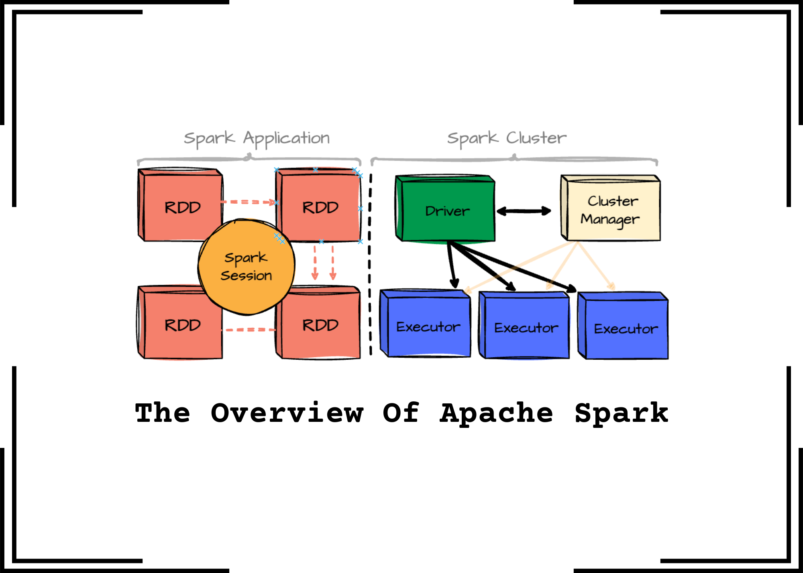
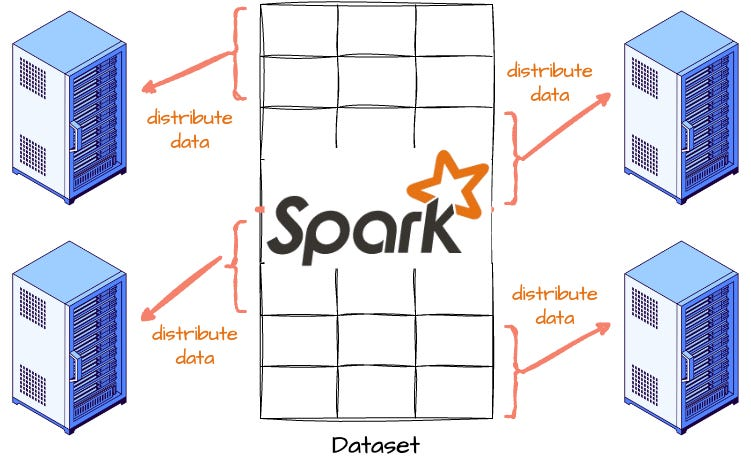
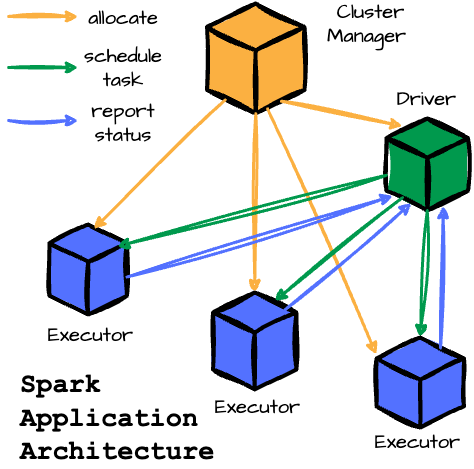
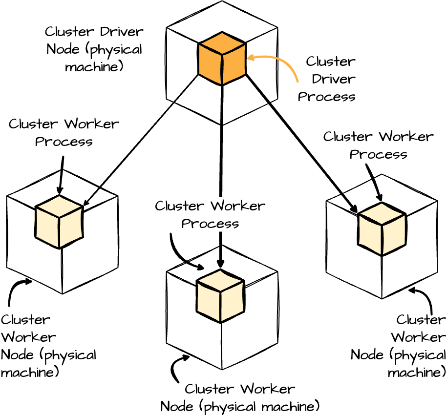
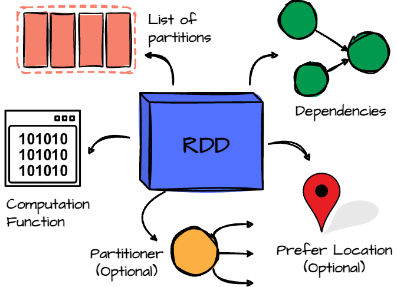
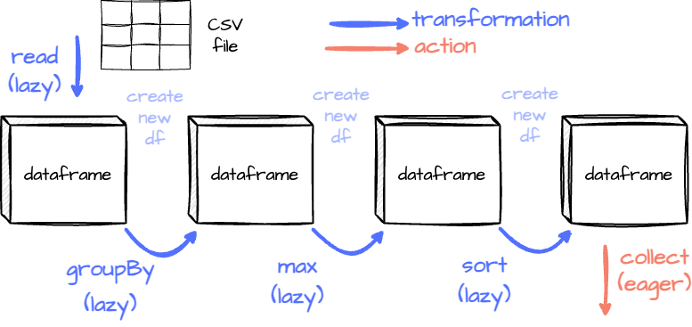

# The Overview Of Apache Spark

## Intro
**This week, we’ll explore Apache Spark. Given the vast scope of this processing engine, starting with an overview seems like the best approach to streamlining my learning process.**

**In this article, I’ll provide a high-level introduction to Apache Spark. We’ll begin with some background on Spark and then explore the typical architecture of a Spark application. Following that, we’ll examine its core data abstraction, the RDD, and conclude by walking through the flow of a Spark application.**

## Background
**At its core, Apache Spark is an open-source distributed computing system designed to quickly process large volumes of data that can hardly accomplished by operating on a single machine. Spark distributes data and computations across multiple machines, allowing for parallel processing.**

**It was first developed at UC Berkeley’s AMPLab in 2009. At that time, Hadoop MapReduce was the leading parallel programming engine for processing massive datasets across multiple machines. AMPLab collaborated with early MapReduce users to identify its strengths and limitations, driving the creation of more versatile computing platforms. They also worked closely with Hadoop users at UC Berkeley, who focused on large-scale machine learning requiring iterative algorithms and multiple data passes.**

**These discussions highlighted some insights. Cluster computing had significant potential. However, MapReduce made building large applications inefficient, especially for machine learning tasks requiring multiple data passes. For example, the machine learning algorithm might need to make many passes over the data. With MapReduce, each pass must be written as a separate job and launched individually on the cluster.**

**To address this, the Spark team created a functional programming-based API to simplify multistep applications and developed a new engine for efficient in-memory data sharing across computation steps.**

## The Spark Application Architecture
**A typical Spark application consists of several key components:**

- **Driver: This JVM process manages the Spark application, handling user input and distributing work to the executors.**

- **Cluster Manager: This component oversees the cluster of machines running the Spark application. Spark can work with various cluster managers, including YARN, Apache Mesos, or its standalone manager.**

- **Executors: These processes execute tasks the driver assigns and report their status and results. Each Spark application has its own set of executors. A single worker node can host multiple executors.**

> **Note: You might find some confusion here. The cluster manager will have its own “driver” (sometimes called master) and “worker” abstractions. The main difference is that these are tied to physical machines rather than Spark processes.**

## Job, Stage, and Task
**Job: In Spark, a job represents a series of transformations applied to data. It encompasses the entire workflow from start to finish.**

**Stage: A stage is a job segment executed without data shuffling. Spark splits the job into different stages when a transformation requires shuffling data across partitions.**

**Task: A task is the smallest unit of execution within Spark. Each stage is divided into multiple tasks, running the same code on a separate data partition executed by individual executors.**

**In Spark, a job is divided into stages wherever data shuffling is necessary. Each stage is further broken down into tasks and executed parallel across different data partitions. A single Spark application can have more than one Spark job.**

## Resilient Distributed Dataset (RDD)
**RDD is the primary data abstraction. Whether DataFrames or Datasets are used, they are compiled into RDDs behind the scenes. It represents an immutable, partitioned collection of records that can be operated on in parallel. Data inside RDD is stored in memory for as long and as much as possible.**

### Properties
**Internally, each RDD in Spark has five key properties:**

- **List of Partitions: The RDD is divided into partitions, which are the units of parallelism in Spark.**

- **Computation Function: A function determines how to compute the data for each partition.**

- **Dependencies: The RDD keeps track of its dependencies on other RDDs, which describes how it was created.**

- **Partitioner (Optional): For key-value RDDs, a partitioner specifies how the data is partitioned, such as using a hash partitioner.**

- **Preferred Locations (Optional): This property lists the preferred locations for computing each partition, such as the data block locations in the HDFS.**

### Lazy Evaluation
**When you define the RDD, its inside data is not available or transformed immediately until an action triggers the execution. This approach allows Spark to determine the most efficient way to execute the transformations.**

- **Transformations, such as map or filter, are operations that define how the data should be transformed, but they don't execute until an action forces the computation. Spark doesn't modify the original RDD when a transformation is applied to an RDD. Instead, it creates a new RDD that represents the result of applying the transformation because RDD is immutable.**

- **Actions are the commands that Spark runs to produce output or store data, thereby driving the actual execution of the transformations.**

### Partitions
**When an RDD is created, Spark divides the data into multiple chunks, known as partitions. Each partition is a logical data subset and can be processed independently with different executors. This enables Spark to perform operations on large datasets in parallel.**

> **Note: I’ll explore the Spark partiions in detail in an upcoming article**

### Fault Tolerance
**Spark RDDs achieve fault tolerance through lineage. Spark forms the dependency lineage graph by keeping track of each RDD’s dependencies on other RDDs, which is the series of transformations that created it.**

**Suppose any partition of an RDD is lost due to a node failure or other issues. In that case, Spark can reconstruct the lost data by reapplying the transformations to the original dataset described by the lineage. This approach eliminates the need to replicate data across nodes. Instead, Spark only needs to recompute the lost partitions, making the system efficient and resilient to failures.**

### Why RDD immutable
**You might wonder why Spark RDDs are immutable. Here’s the gist:**

- **Concurrent Processing: Immutability keeps data consistent across multiple nodes and threads, avoiding complex synchronization and race conditions.**

- **Lineage and Fault Tolerance: Each transformation creates a new RDD, preserving the lineage and allowing Spark to recompute lost data reliably. Mutable RDDs would make this much harder.**

- **Functional Programming: RDDs follow functional programming principles that emphasize immutability, making it easier to handle failures and maintain data integrity.**